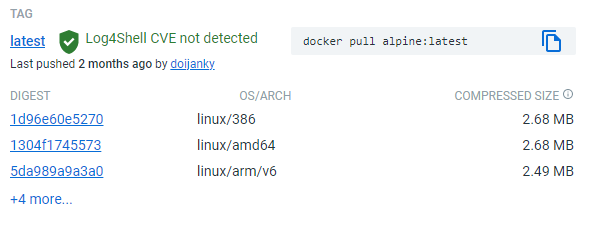

# Docker基础镜像建议

嗐，我一个Docker萌新，给什么建议啊。这些算是自己边碰壁边总结的一些经验教训吧，很多也是从各处看过来的。

我觉得刚开始写Dockerfile的时候，从第一行 `From`就超级让人犯难的。简直是选择困难症者的噩梦啊！因为条条道路通罗马啊，基准镜像的选择往往是很多的，简直看花眼啊！自己稍微写了4567个Dockerfile文件之后，稍微有点经验了，感觉是以下几点的综合考虑：

- 可靠程度
- 镜像大小
- 应用的具体性质
- 当前最新tag版

### 可靠程度

首选官方Hub认证的版本，也就是Docker Hub上标着  “ DOCKER OFFICIAL IMAGE ”, “ VERIFIED PUBLISHER ”和"SPONSORED OSS"的基础镜像:

https://hub.docker.com/search?image_filter=official%2Cstore%2Copen_source&q=

原因不言而喻，安全可靠有售后。

缺点也是有的: 从头开始, 要为自己所用还需要添加不少自定步骤. 有时候天朝自有国情,还需要在原版基础上再做调整.

### 镜像大小

几乎是Docker最有优势的点，体积可以做到很小，无需一大堆不必要的系统文件和库。那怎么知道哪个更小呢。拉到本地之后，执行`docker images`当然能看得出来。

但肯定还是希望没拉下来之前就知道，太大了肯定就pass了。Docker Hub里其实也写着：

选个尽量小的就是。

缺点: 越少的镜像, 要动手调整的地方就越多.

### 应用的具体性质

- 如果只是拿来运行一些普通的Linux程序，那对体积做了优化的`alpine`是最常见的选择；

- 如果是要编go语言的，那最佳组合是` golang:alpine3.16`+ `alpine:3.16`,前者用于编译下载git repo和编译go,后者用于运行. 实际只用到后者,所以体积可以做到很小.

- 如果要运行Apache/PHP等LAMP系列的,可以选择类似: `php:apache-XXXX`. 这个在官方php仓库一搜,发现版本也很众多, 如7.4-apache-bullseye, 7.4-apache-buster 等等. `bullseye`和`buster`这些是Debian发行版的产品代号,看自己的兼容性具体需求再选择合适的. 如果觉得这些官方版本还是太从零开始造轮子,也可以选择一些比较成熟的第三方基础镜像, 如 https://github.com/webdevops/Dockerfile/.

  

### tag版本的选择

这个repo里,存放了官方认可的镜像的全部元信息. 包括各种分支版本,各种tag版本. 

https://github.com/docker-library/repo-info

可以看到版本眼花缭乱，非常多。 基础镜像最好不要选择`latest`的版本，如`alpine:latest`。 因为官方的`latest`版本是一直在升级的。如果生产环境用了官方的latest版本，就有可能在未全面测试兼容性的情况下，直接就升级了基础镜像，最后引入了未知兼容性问题。

最好选择当前最新的有tag号的版本。如当前写这篇文档的时候`alpine`的最新tag打到了`[3.16.2]`，所以基础镜像可以写`FROM golang:alpine3.16.2 `。 以后如果官方有升级，可以自己修改这个基础版本的tag，然后充分测试自己应用的兼容性。

### Alpine, Slim, Stretch, Buster, Jessie, Bullseye等代号
在很多基础镜像的tag里，都会看到有alpine, slim, stretch, buster, jessie, bullseye等字样。如下图是node（https://hub.docker.com/_/node ）的标签列表：

这些字样代表什么含义呢？

- slim

这是在完整版基础上，做了裁剪的精简版。这种镜像通常指包含当前应用所需的最少安装包。好处当然就是空间占用经过很好的优化，都非常小；缺点就是，很可能缺少你需要的一些库或者程序，需要做更大量的测试和调试。

- alpine

Alpine 镜像出自 [Alpine Linux Project](https://alpinelinux.org/) 项目，它可以说是一种专供容器使用的特殊版Linux。 它的优点是体积真的非常小！原生操作系统的部分才5M多。但不好的地方是兼容性差，它使用的不是glibc库，而是 musl 库。如果你的程序需要调用libc专有的接口，可能会有不兼容的问题。在这个操作系统上编译出来的二进制执行文件，也无法在其他的linux操作系统上使用。

- jessie, stretch, buster, bullseye

都是Debian系统的系统代号（codename），详见：https://www.debian.org/releases/。

至于选哪个版本，主要还是看具体应用的要求和兼容性情况了。
