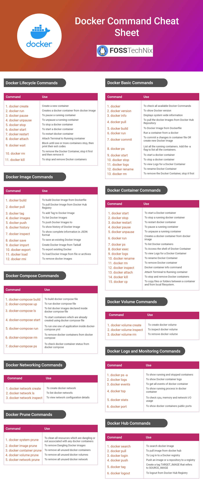

# Docker命令行小抄

## 81条 Docker 命令

### Docker 生命周期管理

Below are some commonly used Docker Basic commands you will use frequently.

1) docker – To check all available Docker Commands

2) docker version – To show Docker version

3) docker info – Displays system wide information

4) docker pull – To pull the docker Images from Docker Hub Repository

5) docker build – To Docker Image from Dockerfile

6) docker run – Run a container from a docker image.

7) docker commit – To commit a changes in container file OR create new Docker Image

8) docker ps – List all the running containers. Add the -a flag to list all the containers.

9) docker start – To start a docker container

10) docker stop– To stop a docker container

11) docker logs -To view Logs for a Docker Container

12) docker rename – To rename Docker Container

13) docker rm – To remove the Docker Container, stop it first and then remove it

### #1. Docker Image Commands

[Docker Image](https://docs.docker.com/engine/reference/commandline/image/) is a application template including binaries and libraries needed to run a Docker container.

Below are some commonly used Docker Image commands while working with Docker.

1) docker build – To build Docker Image from Dockerfile

2. docker pull – To pull Docker Image from Docker Hub Registry

3. docker tag – To add Tag to Docker Image

\4. docker images – To list Docker Images

5. docker push – To push Docker Images to repository

\6. docker history – To show history of Docker Image

7. docker inspect– To show complete information in JSON format

8. docker save – To save an existing Docker Image

9. docker import – Create Docker Image from Tarball

10. docker export – To export existing Docker container

11. docker load– To load Docker Image from file or archives

12. docker rmi– To remove docker images

#2. Docker Container Commands

1) docker start – To start a Docker container

2) docker stop – To stop a running docker container

3) docker restart – To restart docker container

4) docker pause – To pause a running container

5) docker unpause – To unpause a running container

6) docker run – Creates a docker container from docker image

7) docker ps – To list Docker containers

8) docker exec – To Access the shell of Docker Container

9) docker logs – To view logs of Docker container

10) docker rename – To rename Docker container

11) docker rm – To remove Docker container

12) docker inspect – Docker container info command

12) docker attach – Attach Terminal to Running container

12) docker kill – To stop and remove Docker containers

13) docker cp – To copy files or folders between a container and from local filesystem.

#3. Docker Compose Commands

Docker compose is used to run multiple containers in a single application.

Below are some commonly used docker compose command line you should know

1) docker-compose build – To build docker compose file

2) docker-compose up – To run docker compose file

3) docker-compose ls – To list docker images declared inside docker compose file

4) docker-compose start – To start containers which are already created using docker compose file

5) docker-compose run – To run one one of application inside docker-compose.yml

6) docker-compose rm – To remove docker containers from docker compose

7) docker-compose ps – To check docker container status from docker compose

#4. Docker Volume Commands

1) docker volume create – To create docker volume

2) docker volume inspect – To inspect docker volume

3) docker volume rm – To remove docker volume

#5. Docker Networking Commands

1) docker network create – To create docker network

2) docker network ls – To list docker networks

3) docker network inspect – To view network configuration details

#6. Docker Logs and Monitoring Commands

1) docker ps -a – To show running and stopped containers

2) docker logs – To show Docker container logs

3) docker events – To get all events of docker container

4) docker top – To show running process in docker container

5) docker stats – To check cpu, memory and network I/O usage

6) docker port – To show docker containers public ports

#7. Docker Prune Commands

Using Docker prune we can delete unused or dangling containers, Images , volumes and networks

To clean all resources which are dangling or not associated with any docker containers

```
docker system prune
```

To remove unused and stopped docker images

```
docker system prune -a
```

To remove Dangling Docker images

```
docker image prune``docker image prune -a
```

To remove all unused docker containers

```
docker container prune
```

To remove all unused docker volumes

```
docker volume prune
```

To remove all unused docker networks

```
docker network prune
```

We have covered Docker command cheat sheet.

#8. Docker Hub Commands

To search docker image

```
docker search ubuntu
```

To pull image from docker hub

```
docker pull ubuntu
```

Push the Docker Image again

```
docker push fosstechnix/nodejsdocker
```

To logout from Docker Hub Registry

```
docker logout
```

#9. 小抄图


