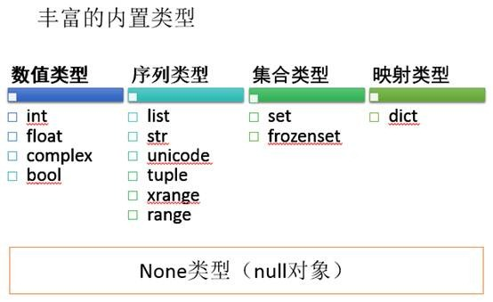

# Python 数据类型

## String：

字符串放在单引号、双引号、三引号（多行时）中，从0开始索引，支持

- 查：find、index、

- 切片： s[0:2]、s[1:]

- 连接：“abc”+“ef” => “abcdef”、join

- 分割：split

- 格式化： format

- 。。。大小写转换、编码等操作

## list, []：
例子：names=[“Dave”, “Mark”, “Ann”]

列表从0开始索引，索引元素names[1]。列表可以包括任意类型的对象，可以嵌套。支持增、删、查、分片。

- 增：insert、append

- 删：del、remove、pop

- 查：search

- 切片： names[0:2]、[1:]

- 连接：[1,2,3]+[4,5] => [1,2,3,4,,5]、extend

- 反转：reverse

## tuple， ()：
例子：`address=(“www.python.org”, 80)，a = (80,)`

元组语法与list相似，意义相当于枚举，可以为空，如果只含有一个元素，需要加逗号以区别于表达式（“one”, ）。元组创建之后不可修改，即无法替换、删除、插入，但支持

- 索引：address[0] => [www.python.org](http://www.python.org/)

- 切片：address[0:] => ('www.python.org', 80)

- 连接：(“www.python.org”,) + (80,) => ('www.python.org', 80)

- host,port=address：host => [www.python.org](http://www.python.org/)，port => 80

## 字典： dict()， {}：
例子：`address={"host":"www.python.org", "port":80} `

- 索引：address[“host”] => “www.python.org”,

- get：address.get("host") => “www.python.org”

- 键：address.keys() => ['host', 'port']

- in："host" i- address =>True

- 删除：del address["host"] => {'port': 80}

## 集合：set()，a=set([1,2,3,4]);
例子：一个数值集合 `b=set(“hello”)`，一个唯一字符集合。

与列表、元组不同，集合中的元素是无序的，无法通过数字索引，且元素不能重复。

- 并集：a|b => set([1, 2, 3, 4, 'h', 'l', 'o', 'e'])

- 交集：a&b => set([])

- 差集：a-b => set([1, 2, 3, 4])，即在a中不在b中元素

- 对称差集：a^b => set([1, 2, 3, 'e', 'h', 'l', 'o', 4])

- add：a.add(5) => set([1, 2, 3, 4, 5]) #添加一项

- update: a.update([6,7,8]) =>set([1, 2, 3, 4, 5, 6, 7, 8])#添加多项

- remove: a.remove(5) =>set([1, 2, 3, 4, 6, 7, 8])#删除一项